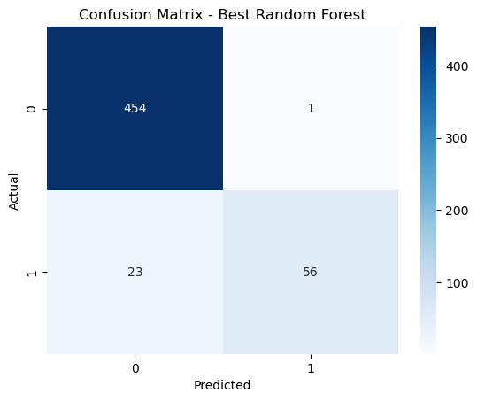

# Customer Churn Prediction

This project demonstrates a machine learning pipeline to predict customer churn using classification models. The dataset used contains customer data including usage metrics and service plans, and the target variable is whether the customer has churned or not.

---

## Project Overview

- Load and preprocess the dataset (clean, encode categorical variables, handle missing values)
- Feature scaling with StandardScaler
- Train-test split
- Train and evaluate three classification models:
  - Logistic Regression
  - Decision Tree Classifier
  - Random Forest Classifier
- Hyperparameter tuning for the best performing Random Forest model using GridSearchCV
- Model evaluation using accuracy, precision, recall, F1 score, and confusion matrix visualization

---

## Dataset

The dataset used is `churn-bigml-80.csv`. It includes features such as:

- Customer account details (account length, phone service, international plan)
- Usage statistics (day, evening, night, and international call minutes and charges)
- Customer service calls count
- Target variable: `Churn` (whether the customer left or not)

*Note: The dataset should be placed in the local directory or update the path in the script accordingly.*

---

## How to Run

1. Clone the repository:
   ```bash
   git clone https://github.com/your-username/churn-prediction.git
   cd churn-prediction

## Results

The script outputs:

-Model performance metrics (accuracy, precision, recall, F1 score) for Logistic Regression, Decision Tree, and Random Forest.
-Best hyperparameters for Random Forest after Grid Search.
-Confusion matrix heatmap for the best Random Forest model.

## Code Highlights

-Flexible mapping of churn target variable to handle various data formats
-Handling of missing values and categorical encoding
-Use of StandardScaler for feature normalization
-Model evaluation with detailed classification report
-Hyperparameter tuning using GridSearchCV

## Dependencies

-Python 3.x
-pandas
-numpy
-scikit-learn
-seaborn
-matplotlib

## screenshot




